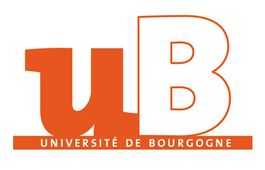
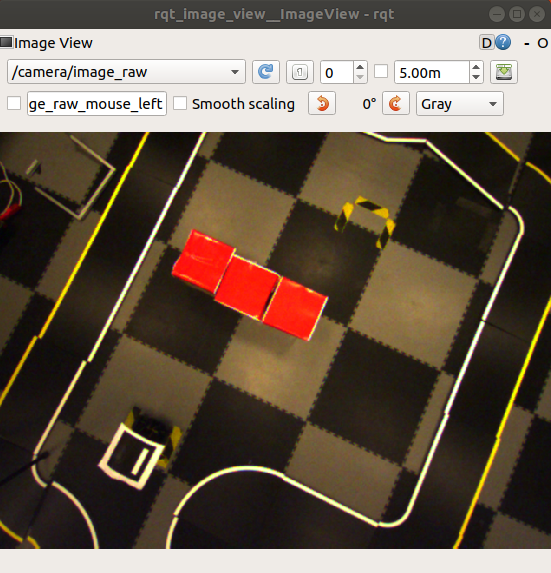
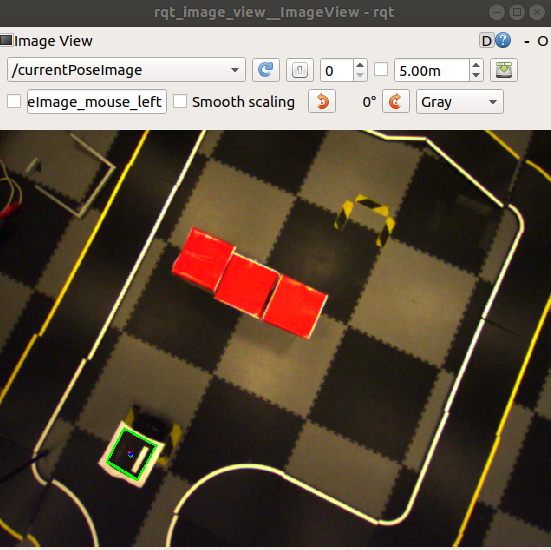
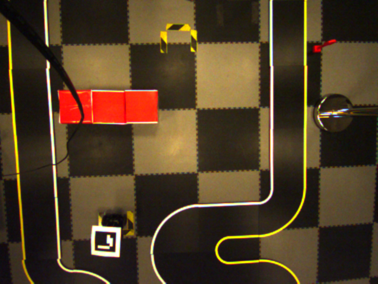
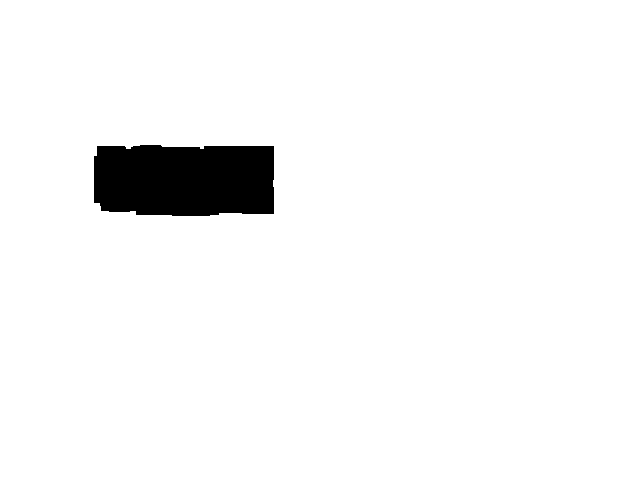

<p align="center">  
   
</p >

# <p align="center">University of Burgundy
</p > 

# <p align="center">Master of Computer vision and Robotics</p >   
<p align="center">  


   
</p >

# <p align="center">Multi-Sensor Fusion and Tracking
</p> 

## <p align="center">Supervisors:</p > 
<p align="center"> Omar Tahri</p >   
<p align="center"> Ahmed Wael Ahmed Hossameldin
          </p >   

   

## <p align="center">Student:</p >

<p align="center">Shriarulmozhivarman Gobichettipalayam</p>


## Table of contents:
- [Aim of the Project](#aim-of-the-project)
- [Introduction](#introduction)
- [Prior Knowledge](#prior-knowledge)
- [Tasks](#tasks)
   - [Camera Calibration](#camera-calibration)
   - [Pose Estimation](#pose-estimation)
   - Go to Goal Pose(with no obstacle)
   - Go to Goal Pose(with obstacle)
- [Setup to run the package](#setup-to-run-the-package)
- [Conclusions](#Conclusions)
- [References](#References)


## Aim of the Project
- Estimate Pose of the robot in --
- Go to a Goal Pose(with no obstacle).
- Navigate to a Goal Pose with obstacle

## Introduction

The Robot Operating System (ROS) is an open-source robotics middleware suite and a framework for robot software development, providing operating system-like functionality.ROS provides standard operating system services such as hardware abstraction, low-level device control, implementation of commonly-used functionality, message-passing between processes, and package management.

TurtleBot3(Burger) is a programmable ROS-based mobile robot used in research and education.The turtlebot3 burger has the sensors,but for this project we will not use any sensors from the robot and control borads such as [OpenCR1.0](https://emanual.robotis.com/docs/en/platform/turtlebot3/appendix_opencr1_0/) (for low level control) and a Single Board Computer  [Raspberry Pi 3B+](https://www.raspberrypi.com/products/raspberry-pi-3-model-b-plus/)(for high level control and running ros Nodes).All the sensing is done with the ueye camera in eye-to-hand configuration.


## Prior Knowledge

- Use ueye camera for eye-to-hand configuration(must be calibrated).
- Use aucroMarkers for pose estimation.
- The Obstacles are of Red in Color. 


## Tasks
- #### Camera Calibration 
The ueye camera must be calibrated to get the internic parameters of the camera, that can be used to estimate the postion the aruco markers.The calibration can be doen using the *camera_calibration package* from ros. To calibrate the camera launch the brg8 launch to get the images from which we can calibrate the camera  and launch the camera_calibration ros node.
```
$ roslaunch ueye_cam rgb8.launch
$ rosrun camera_calibration cameracalibrator.py --size 8x6 --square 0.108 image:=/camera/image_raw camera:=/camera
```
Results of camera calibration : 
```
width
640

height
480

[narrow_stereo]

camera matrix
244.092747 0.000000 287.492660
0.000000 243.870806 212.516072
0.000000 0.000000 1.000000

distortion
0.010984 -0.005869 -0.000289 -0.000152 0.000000

rectification
1.000000 0.000000 0.000000
0.000000 1.000000 0.000000
0.000000 0.000000 1.000000

projection
244.093552 0.000000 286.197016 0.000000
0.000000 245.035217 212.236631 0.000000
0.000000 0.000000 1.000000 0.000000
```


- #### Pose Estimation

we can detect aurco markers in the image from the camera that we subscribe to,since the camera is calibrated we also get the position, orientation of the auro marker. For aurco marker Detection I used the opencv functionalities.


<p align="center
">
  
</p>
Once the marker is detected a axis is drawn for reference. And publish the image and pose as the current pose of the robot.The 


- #### Go to Goal Pose(with no obstacle)

Since we dont have any obstacle, we can control the robot by publishing to */cmd_vel* topic until the distance and the angle between the current and goal is less than 0.01 meter and 0.01 rads.


https://user-images.githubusercontent.com/42157171/146118747-4c6c2866-fa61-42d7-9b00-a9efee1d15d5.mp4

The video above shows the go the goal with no obstacle, from the camera view and the current pose marker with green box.

https://user-images.githubusercontent.com/42157171/146262430-0dfd79eb-ca42-4ea3-9e0e-4278d0bffff6.mp4

The video above shows the go the goal with no obstacle, from a world view. 


The video above shows the go the goal with no obstacle. The code works for most of the time but, not always. sometime it goes near the goal and stop. This may be due to the fact the camera is fish eye camera, with almost a normal camera characters and I consider the camera as normal camera model for this project and this maybe a reason for this behaviour.

- #### Go to Goal Pose with obstacle.

Since the obstacle is of red in color, we can you filter and it in the image to create a map that can be provided to the *move_base* package to paln a path to the goal.

<p align="center
">
  
</p>

The above image is image from the camera and the corrosponding map created for *move_base* package.Were the black spot in the map is the detetecd obstacle to avoid.we have to measure the distance the from one side to the other side to find the resultion to map that must be set to the map configuration


https://user-images.githubusercontent.com/42157171/146118958-ae5b4de1-bdff-4c09-889a-79bfaebeee89.mp4

The video above shows the go the goal with no obstacle, from the camera view and the current pose marker with green box.

https://user-images.githubusercontent.com/42157171/146263962-17da4852-7d48-49dd-9c1a-a44cf176b5e0.mp4

The video above shows the go the goal with no obstacle, from a world view. 


The video above shows the go the goal with obstacle. The code works for most of the time but, not always. sometime it goes near the goal and stop. This may be due to the fact the camera is fish eye camera, with almost a normal camera characters and I consider the camera as normal camera model for this project and this maybe a reason for this behaviour.

## Setup to run the package
**Step-1** Launch roscore on *Remote PC*
```
$ roscore
```
**Step-2** Launch the turtlebot3 bringup on *SBC*
```
$ roslaunch turtlebot3_bringup turtlebot3 robot.launch
```


**Step-3** Launch the ueye camera node to start the video capture on *Remote PC*
```
$ roslaunch ueye_cam rgb8.launch
```


**Step-4** Launch the getGoal node to goal pose and create map if any obstacle is present on *Remote PC*
```
$ rosrun turtlebot3_visual_servoing getGoal.py  
```
Once the goal pose is captured kill the node.

**Step-5** Launch the turtlebot3 visualservoing  goToGoal node to make robot to go to the Goal Pose if there is no obstacle on *Remote PC*.
```
$  roslaunch turtlebot3_visual_servoing gotoGoal.launch  
```
OR

**Step-5** Launch the turtlebot3 visualservoing  goToGoal node to make robot to go to the Goal Pose if there are obstacle on *Remote PC*.
```
$ roslaunch turtlebot3_visual_servoing navigateObstacle.launch 
```

## Conclusions
## References

- [ROS cv_bridge](http://wiki.ros.org/cv_bridge)
- [ROS Tutorials](http://wiki.ros.org/ROS/Tutorials)
- [geometry_msgs](http://wiki.ros.org/geometry_msgs)
- [sensor_msgs](http://wiki.ros.org/sensor_msgs)
- [TurtleBot3 Offical Tutorials](https://emanual.robotis.com/docs/en/platform/turtlebot3/overview/)
- [ROS Perception in 5 Days Python](https://www.theconstructsim.com/robotigniteacademy_learnros/ros-courses-library/ros-perception-in-5-days/)
- [OpenCV Basics for Robotics Python](https://www.theconstructsim.com/robotigniteacademy_learnros/ros-courses-library/opencv-basics-for-robotics/)
